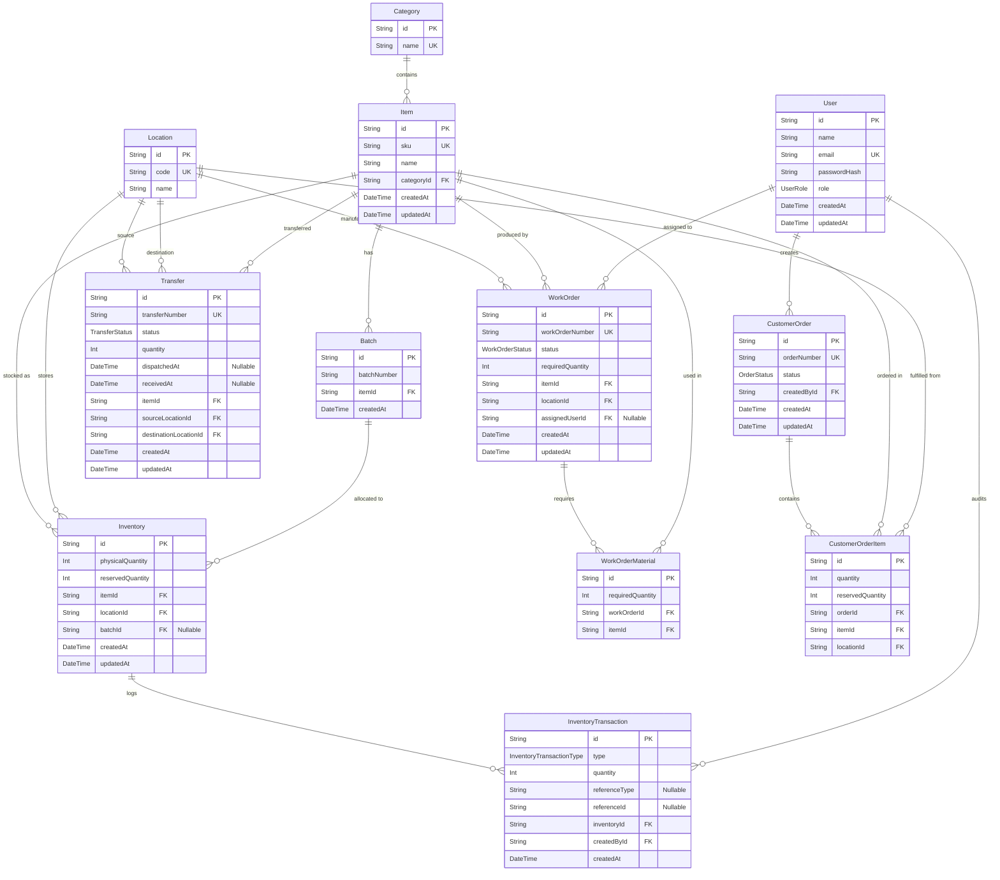

# Mini Operations ERP - Entity Relationship Diagram

This diagram visualizes the database schema for the Mini Operations ERP system, directly reflecting the implemented Prisma schema.



## How to View This Diagram
- **On GitHub**: GitHub automatically renders Markdown code blocks tagged with `mermaid`. Just view this file directly in the GitHub repository.
- **Locally**: Install a Markdown preview extension that supports Mermaid in your IDE (like VSCode's "Markdown Preview Mermaid Support").
- **Online**: Copy the code block above (everything between ` ```mermaid ` and ` ``` `) and paste it into the [Mermaid Live Editor](https://mermaid.live/) to view, edit, or export the diagram as a PNG/SVG image.
